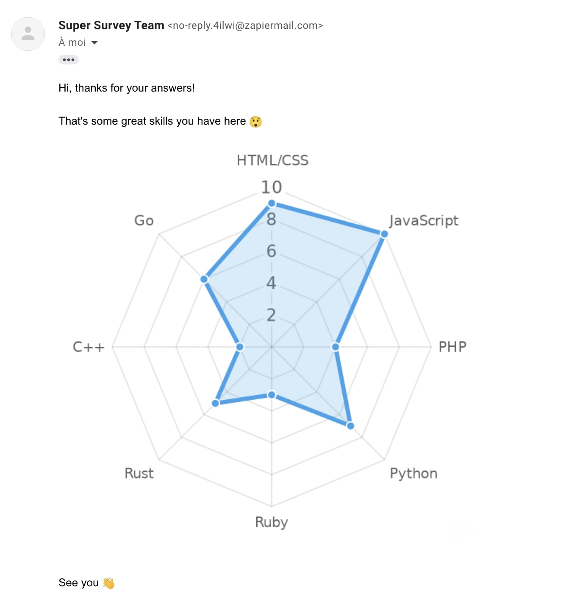

Typeform is a great app to make surveys. We'll see here how we can generate a form and send each respondent a custom-made radar chart.

### Create your form

1. Go to [typeform.com](https://www.typeform.com/) and create an account (or login).
2. Create a form asking the respondent email (type Email), and a series of Opinion Scale questions from 1 to 10. In our example we'll ask the user to rate his programming language skills, hopefully you'll be more creative than us! 😀


### Create the image with Zapier & Image-Charts

!!! Note
    We'll use Zapier in our guide, but you can also do this with [Make.com](https://www.make.com/) (Integromat).

1. Go to [zapier.com](https://zapier.com/) and create an account (or login).
2. [Create a new Zap](https://zapier.com/editor/sandbox/draft/1/setup)

Chose Typeform as a Trigger, and then follow the steps to use your form.

When asked for what action to use, select Image-Charts with the "Create a Chart.js Chart" event.

Copy/Paste the following Chart.js configuration object and replace the placeholders by Zapier values, and the labels if you wish to:

```js
{
  type: 'radar',
  data: {
    labels: ['HTML/CSS', 'JavaScript', 'PHP', 'Python', 'Ruby', 'Rust', 'C++', 'Go'],
    datasets: [
      {
        data: [PLACEHOLDER_HTML_CSS, PLACEHOLDER_JAVASCRIPT, PLACEHOLDER_PHP, PLACEHOLDER_PYTHON, PLACEHOLDER_RUBY, PLACEHOLDER_RUST, PLACEHOLDER_C_PLUS_PLUS_, PLACEHOLDER_GO],
        fill: true,
        backgroundColor: 'rgba(54, 162, 235, 0.2)',
        borderColor: 'rgb(54, 162, 235)',
        pointBackgroundColor: 'rgb(54, 162, 235)',
        pointBorderColor: '#fff',
      },
    ],
  },
  options: {
    legend: {
      display: false,
    },
    layout: {
      padding: 10
    },
    scale: {
      ticks: {
        beginAtZero: true,
        stepSize: 2,
      },
    },
  },
}
```

These options were tested on our charts editor, you can play with it:
[![chart](https://image-charts.com/chart.js/2.8.0?bkg=white&chart=%7B%0A%20%20type%3A%20%27radar%27%2C%0A%20%20data%3A%20%7B%0A%20%20%20%20labels%3A%20%5B%27HTML%2FCSS%27%2C%20%27JavaScript%27%2C%20%27PHP%27%2C%20%27Python%27%2C%20%27Ruby%27%2C%20%27Rust%27%2C%20%27C%20%20%27%2C%20%27Go%27%5D%2C%0A%20%20%20%20datasets%3A%20%5B%0A%20%20%20%20%20%20%7B%0A%20%20%20%20%20%20%20%20data%3A%20%5B9%2C%2010%2C%204%2C%207%2C%203%2C%207%2C%202%2C%206%5D%2C%0A%20%20%20%20%20%20%20%20fill%3A%20true%2C%0A%20%20%20%20%20%20%20%20backgroundColor%3A%20%27rgba%2854%2C%20162%2C%20235%2C%200.2%29%27%2C%0A%20%20%20%20%20%20%20%20borderColor%3A%20%27rgb%2854%2C%20162%2C%20235%29%27%2C%0A%20%20%20%20%20%20%20%20pointBackgroundColor%3A%20%27rgb%2854%2C%20162%2C%20235%29%27%2C%0A%20%20%20%20%20%20%20%20pointBorderColor%3A%20%27%23fff%27%2C%0A%20%20%20%20%20%20%7D%2C%0A%20%20%20%20%5D%2C%0A%20%20%7D%2C%0A%20%20options%3A%20%7B%0A%20%20%20%20legend%3A%20%7B%0A%20%20%20%20%20%20display%3A%20false%2C%0A%20%20%20%20%7D%2C%0A%20%20%20%20layout%3A%20%7B%20%0A%20%20%20%20%20%20padding%3A%2010%20%0A%20%20%20%20%7D%2C%0A%20%20%20%20scale%3A%20%7B%0A%20%20%20%20%20%20ticks%3A%20%7B%0A%20%20%20%20%20%20%20%20beginAtZero%3A%20true%2C%0A%20%20%20%20%20%20%20%20stepSize%3A%202%2C%0A%20%20%20%20%20%20%7D%2C%0A%20%20%20%20%7D%2C%0A%20%20%7D%2C%0A%7D&height=300&width=300)](https://editor.image-charts.com/?tab_viewer=image#https:/image-charts.com/chart.js/2.8.0?bkg=white&chart=%7B%0A%20%20type%3A%20%27radar%27%2C%0A%20%20data%3A%20%7B%0A%20%20%20%20labels%3A%20%5B%27HTML%2FCSS%27%2C%20%27JavaScript%27%2C%20%27PHP%27%2C%20%27Python%27%2C%20%27Ruby%27%2C%20%27Rust%27%2C%20%27C%2B%2B%27%2C%20%27Go%27%5D%2C%0A%20%20%20%20datasets%3A%20%5B%0A%20%20%20%20%20%20%7B%0A%20%20%20%20%20%20%20%20data%3A%20%5B9%2C%2010%2C%204%2C%207%2C%203%2C%207%2C%202%2C%206%5D%2C%0A%20%20%20%20%20%20%20%20fill%3A%20true%2C%0A%20%20%20%20%20%20%20%20backgroundColor%3A%20%27rgba%2854%2C%20162%2C%20235%2C%200.2%29%27%2C%0A%20%20%20%20%20%20%20%20borderColor%3A%20%27rgb%2854%2C%20162%2C%20235%29%27%2C%0A%20%20%20%20%20%20%20%20pointBackgroundColor%3A%20%27rgb%2854%2C%20162%2C%20235%29%27%2C%0A%20%20%20%20%20%20%20%20pointBorderColor%3A%20%27%23fff%27%2C%0A%20%20%20%20%20%20%7D%2C%0A%20%20%20%20%5D%2C%0A%20%20%7D%2C%0A%20%20options%3A%20%7B%0A%20%20%20%20legend%3A%20%7B%0A%20%20%20%20%20%20display%3A%20false%2C%0A%20%20%20%20%7D%2C%0A%20%20%20%20layout%3A%20%7B%20%0A%20%20%20%20%20%20padding%3A%2010%20%0A%20%20%20%20%7D%2C%0A%20%20%20%20scale%3A%20%7B%0A%20%20%20%20%20%20ticks%3A%20%7B%0A%20%20%20%20%20%20%20%20beginAtZero%3A%20true%2C%0A%20%20%20%20%20%20%20%20stepSize%3A%202%2C%0A%20%20%20%20%20%20%7D%2C%0A%20%20%20%20%7D%2C%0A%20%20%7D%2C%0A%7D&height=300&width=300)

Then set the following values:

- Version: `Chart.js 2.8.0`
- Chart width: `600`
- Chart height: `600`
- Chart background color in hexadecimal format: `#fff`
- Retina support: `Activate retina mode and double image size`

### Send it via email

We are almost there! The last step is sending the generated chart to the user. To do this:

- Click on the Plus (+) icon at the bottom of the page to add a new step
- Select your own email provider if you have one, or use "Email by Zapier" to test it

Set the following values:

- To: `PLACEHOLDER_TYPEFORM_USER_EMAIL`
- Subject: `Your programming languages skills as a chart!`
- Body (HTML or Plain):

```html
Hi, thanks for your answers! <br />
<br />
That's some great skills you have here 😲 <br />
 <br />
<br />
See you 👋
```

(don't forget to replace `PLACEHOLDER_TYPEFORM_USER_EMAIL` by the typeform user email and `PLACEHOLDER_IMAGE_CHARTS_URL` by the Zapier generated image url)

- From Name: `Super Survey Team`

Continue, test the action and you should receive an email like the following:



🎉🎉🎉
