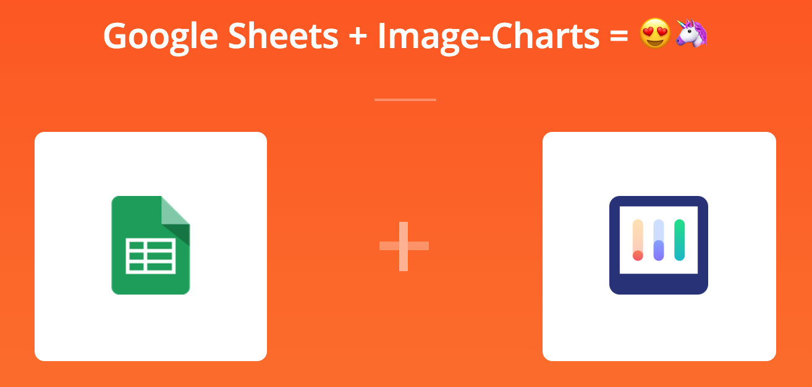

<!-- How to setup a dependency graph in Google Sheets -->



!!! abstract "Use our Google Sheet add-on"
    This tutorial is only there for educational purpose, use our [official  add-on](https://chrome.google.com/webstore/detail/bainjkfkhoipphfdlnlcnoddiggamjpd/) instead if you wish to embed dependency graphs into Google Sheet!


Google Sheets is sometimes used to let teams collaboratively build roadmaps (some other tools like Jira helps there too), it is sometime helpful to visualize interactions and dependencies between these roadmap items.

Let's build a "roadmap" to... make a sandwich.

Items | depends on
:---- |:---------
Get 2 slices of bread |
Put peanut butter on 1 slice | Get 2 slices of bread WOW!
Put jelly on 1 slice | Get 2 slices of bread WOW!
Put away peanut butter jar | Put peanut butter on 1 slice
Put slices together | Put peanut butter on 1 slice,Put jelly on 1 slice
Put away jelly jar | Put jelly on 1 slice

Try to visualize the dependencies between each step, it's hard right?

Sadly, Google Spreadsheets does not offer any kind of graph representations and we are left with our own mental representation, which is not great. Furthermore we can’t easily extend Google Sheets with another chart representation.

Hopefully there is a nice formula function called [IMAGE()](https://support.google.com/docs/answer/3093333?hl=en), that let's us insert image inside a cell.

So we need to generate an image of a graph chart... Wait. That’s exactly what Image-Chart [can do](/graph-viz-charts), it let you generate charts and graphs from a simple URL and then embed it inside emails, bots and... Google Sheets!

How does it work?

Image-charts graph viz format ([cht=gv](/graph-viz-charts/#chart-types)) is built upon the most well known standard to build graph: the [dot language](http://bit.ly/2OpHwtW) and as you will see, it’s quite easy to start with:

```
https://image-charts.com/chart
?cht=gv:dot
&chl=digraph G {
  main -> parse -> execute;
  main -> init;
  main -> cleanup;
  execute -> make_string;
  execute -> printf
  init -> make_string;
  main -> printf;
  execute -> compare;
}
```


The next step we need is create a custom formula function `DEPENDENCY_GRAPH_URL(itemRows, dependsOnRows)` that will require two parameters:

- an `itemRows` column range, representing every roadmap item per row
- a `dependsOnRows` column range, where each row represent a comma-separated list of items the current row depends on.

Looking back at our table, our custom formula function to build a URL like this:

```
https://image-charts.com/chart
?cht=gv
&chl=digraph {
  splines="line";
  rankdir=LR;
  "Get 2 slices of bread"->{"Put peanut butter on 1 slice" "Put jelly on 1 slice"};
  "Put peanut butter on 1 slice"->{"Put away peanut butter jar" "Put slices together"};
  "Put jelly on 1 slice"->{"Put slices together" "Put away jelly jar"}
}
```


!!! Note
    In dot language, `"a" -> {"b" "c"}` let you express that both `b` and `c` depend on `a`.

So our custom function needs to generate the Image-Charts URL that we will then pass to google spreadsheet IMAGE() function. [Here it is!](https://github.com/image-charts/google-sheets-add-on-dependency-graph/blob/master/main.js#L13).

Ok, now let’s run it:


<script>
Array.prototype.slice.call(document.querySelectorAll('img[alt="YOUTUBE"]')).forEach(function(el){
var p;
var id = (p = el.src.split('#'), p[p.length - 1])
var iframe = document.createElement('iframe');
iframe.style = 'width: 100%;height: 450px;border:0px;'
iframe.frameborder = 0;
iframe.allowfullscreen = true;
iframe.src = 'https://www.youtube.com/embed/' + id + '?rel=0&amp;showinfo=0';
el.replaceWith(iframe)
});
</script>

Perfect! We've followed the single-source-of-truth principle from top to bottom, we've got no data duplicated and live graph reload for free, awesome! 🚀
